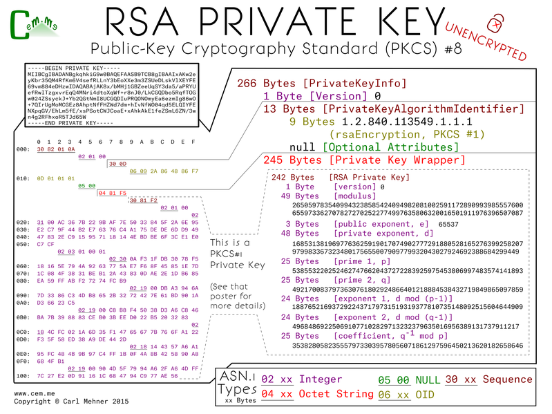
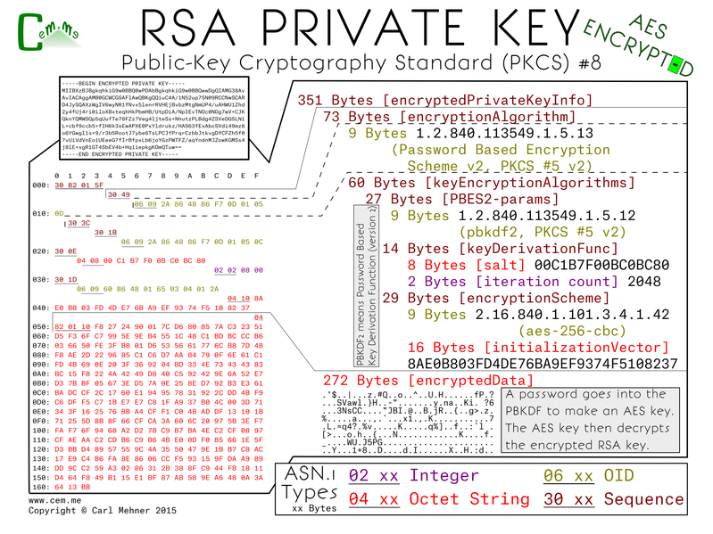

<article markdown="1">

<header markdown="1">
 
# Certificate Binary Posters (Part Two)

<time class="pubdate" datetime="2015-01-04">2015-01-04</time>

</header>

  
<small>If you missed the previous post, you may want to read that first (<a href="20141221-cert-binaries.html">Part One</a>)</small>

  
The previous post shows one way to store private keys, the PKCS#1 format. This post shows a different format, PKCS#8. This format is more extensible, allowing for more than just the one type of key to be stored. This format splits up the private key representation into three sections: a version, an algorithm identifier, and the actual private key. The version is set at 0, and may eventually change if there are any updates to the standard. The algorithm ID is an OID defined as "RSA Encryption" for use with the PKCS#1 standard. That is to say, the very same standard we went over in the previous post. The last part is a wrapper for the PKCS#1 private key object. This is the exact same thing byte for byte as the PKCS#1 private key.

  

  
Unprotected private keys like that are not the best thing to keep laying around, luckily, there's another version of the PKCS#8 which holds an encrypted version of the private key. This format is broken into two pieces, an encryption algorithm and the encrypted data. The encryption algorithm starts with the algorithm identifier for the Password Based Encryption Scheme. The next section is a container for the parameters and data needed to derive the encryption key. For this example I chose to use the Password Based Encryption Scheme #2 (better known as PBKDF2). Fed into the BPKDF2 are the salt, the number of times to run the pseudorandom function over the passphrase used to encrypt the key. Next is the encryption scheme, AES-256-CBC and the initialization vector for the AES algorithm. The key resulting from the PBKDF2 and the salt are fed in as parameters to the AES function along with the message found in the encrypted data section. The result of the decryption is a BER (Basic Encoding Rules) encoded octet string. An octet string you may recognize from above (hint: it's the private key sequence).

  

  
Also, please note, AES is not the default algorithm for encrypting keys in openssl. The less secure, 3DES is the default, for openssl you must specify '-aes256' on the commandline to the genrsa or rsa command line applications.

</article>

