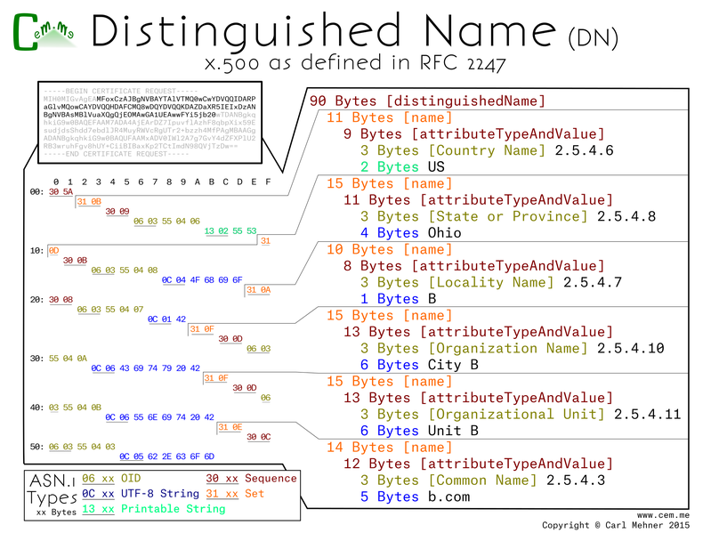
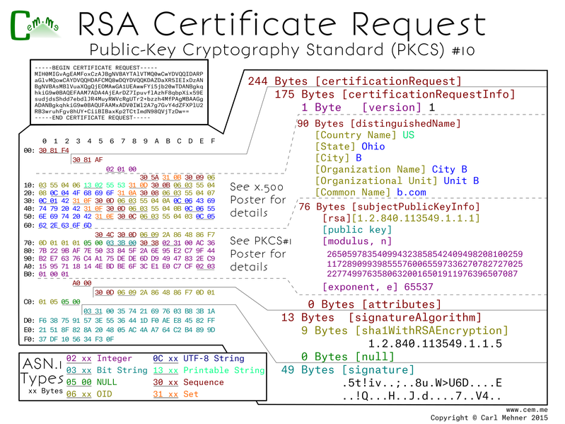

<article markdown="1">

<header markdown="1">
 
# Certificate Binary Posters (Part Three)

<time class="pubdate" datetime="2015-01-21">2015-01-21</time>

</header>

  
<small>If you missed the previous posts, you may want to read them first (<a href="20141221-cert-binaries.html">Part One</a>, <a href="20150104-cert-binaries-2.html">Part Two</a>)</small>
  
  
This first part is a building block for more wonderful things to come. The Distinguished Name for x.500 are the basis for identity and trust on the Internet. You may notice that the base64 in the upper left is a certificate request, I highlighted the bytes to pull out of that to show this detailed view in order to clarify this more complex block. Each of the names in the that make up the distinguished name are an ASN.1 'set' containing a 'sequence' of the attribute type and the value of the attribute. The attribute type is an OID (Object IDentifier), a hierarchical structure used to describe namespaces. All of the OIDs here are under the x.500 attribute types namespace. Second within the set, after the OID, is the value associated to it: country, state, local, et seq. This is encoded in the UTF-8 (<b>U</b>niversal Character Set + <b>T</b>ransformation <b>F</b>ormat).

  
  
The base64 in the top left of this next poster is the same as the last, however, as the last focused on the DN, this focuses on most of the rest. I say most because the sequence immediately following the DN is a PKCS#1 object. This is the same thing I went over at the end of <a href="20141221-cert-binaries.html">part one</a>.

  
CSRs are sent to a certificate authority which they then use to produce a signed certificate for use in TLS to secure websites, or any number of other x.509/PKI applications.

  
The entire CSR is contained in one large sequence. Within that is a sequence of request data followed by the CSR signature algorithm and lastly the signature value.

  
The request data is made up of a version (value of 0, meaning of 1; <small>remember computer scientists count from 0...</small>), the DN above (which specifies the request identification information), after that is the PKCS#1 object (identical to the PKCS#1 public key poster). Lastly is the attributes section, here it is empty. The attributes are defined in a PKCS#9 objects. This field is little used now, but at one point it was used to add passwords that the requestor would have to provide at the time of revocation to authenticate to the revocation system.

  
  
Next, what the certificate authority sends back.

</article>
