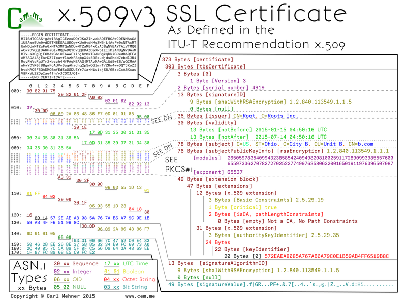

<article markdown="1">

<header markdown="1">
 
# Certificate Binary Posters (Part Four)

<time class="pubdate" datetime="2015-02-09">2015-02-09</time>

</header>
  
  
<small>If you missed the previous posts, you may want to read them first (<a href="20141221-cert-binaries.html">Part One</a>, <a href="20150104-cert-binaries-2.html">Part Two</a>, <a href="20150121-cert-binaries-3.html">Part Three</a>)</small>

  
After the certificate authority (CA) receives the <a href="20150121-cert-binaries-3.html">CSR</a>, it signs it, then sends back the TLS cert. You can see two places in this certificate that directly correspond to the CSR (the public key and the DN). There are three main sections within the certificate wrapper: the tbsCertificate data (tbs = to-be-signed), the structure the specifying signature used to sign the cert, and the signature value. The CA crafts the tbsCertificate from the data given in the CSR, adding additional fields before copying the DN and SPKI (subject public key info; aka the PKCS#1 object).

  
The tbsCertificate starts out with a version container with a version byte, and as with all of the valid TLS certs trusted on the Internet right now, is version 3 (notice the value of 2 on the left due to the 0-based version index). Next the serial number of the cert which because this is an example is shortened, normally it will be <a href="https://cabforum.org/wp-content/uploads/BRv1.2.3.pdf">at least 20</a> random bits. The next field is byte for byte the same as the certificate's signature algorithm ID mentioned above. Following that, the name of the CA that signed the cert goes to the issuer section. The CA's DN sequence is copied to the issuer field of any certificates it signs. The CA also controls the validity dates, the UTC time elements are normally set with the start as the current time, or current GMT date at midnight, with the end date set to a max of 3 years and 3 months (or for extended validation (EV) certs 2 years and 3 months). However, they can be set to nearly any date in the future or in the past. Finally, the DN and SPKI are copied from the CSR and tacked on to the end.

  
Up until now, all of the fields are in x.509v1 certificates, the difference between version 1 and version 3 certificates are that v3 includes the extensions section below the SPKI. Extensions allow for, as the word implies, extensibility. You can have as many or as few extensions as are required, they can be marked critical or noncritical. A critical extension must be understood by the validating software, otherwise the certificate validation must fail. There are rules set by the CA / Browser Forum for which extensions are required for inclusion and which to mark as critical. In this example, (which only follows some of the rules) there is an extension requiring the certificate to be an end-entity (that is not a CA) as well as the AKI (authority key identifier). An AKI is a way to tie a specified end-entity certificate to the certificate that issued it.

  
Lastly, the specified signature algorithm uses the CA's private key to sign the bytes from the tbsCertificate, the result is the signature value.

  
</article>
