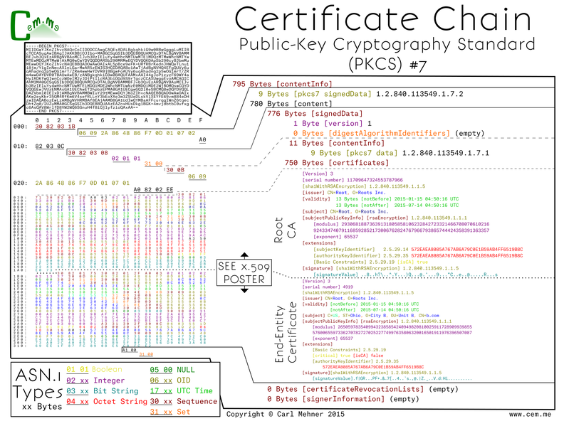

<article markdown="1">

<header markdown="1">
 
# Certificate Binary Posters (Part Five)

<time class="pubdate" datetime="2015-03-01">2015-03-01</time>

</header>
  
  
<small>Previous Posts: (<a href="20141221-cert-binaries.html">Part One</a>, <a href="20150104-cert-binaries-2.html">Part Two</a>, <a href="20150121-cert-binaries-3.html">Part Three</a>, <a href="20150209-cert-binaries-4.html">Part Four</a>)</small>

  
Certificates used in webservers and other end-entity uses are signed by issuers (which should not be root CAs, but it is possible). However, there are a lot of issuer certificates; in 2010 there were <a href="https://www.eff.org/files/ccc2010.pdf">nearly 1500</a>, now certainly more are out there with <a href="https://letsencrypt.org">more planned</a>. Because there are so many undistributed issuing CAs, there needs to be a way for the CA to send the issuer cert to the cert requester along with the end-entity certificate so they can pass that along to anyone that needs to validate their root. One of the common ways to pass public keys for a specific chain is the PKCS #7 format. This format is a way to ensure that the right certificates are used in the chain for the particular server certificate.

  
PKCS #7 begins, as all the others have, with a sequence of the encoded data and length. Immediately following is the OID for PKCS #7 signedData content type. This specifies the type of the content of the p7 object. The content is put into an explicit object that contains a sequence which wraps the object. Inside, the signedData object the structure begins with a version, digest algorithm identifies (empty here), a content info (here specifying the OID for PKCS #7 data), certificates, crls (empty here), and lastly another empty field that can hold additional information on signers.

  
The certificates field is an ASN.1 explicit type wrapper which contains x.509 sequences as they appear in the x.509 posters from <a href="20150209-cert-binaries-4.html">part 4</a>.

</article>
