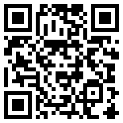

<article markdown="1">

<header markdown="1">

# About Me

Security Engineer and Researcher, focused on encryption, TLS, and PKI

## Email

First letter and at, followed by my domain

</article>

<article markdown="1">

<header markdown="1">

## ZCash - Shielded Address

`z-addr: zs1lmyjscpj7dfjz26ld7h092p05efu85awdf0syup7fk5tdlkt2fd395a3u3m3emd3w3pdk08se0e`

## ZCash - Transparent Address

`t-addr:t1P82E8zApUys2e7KCpyqq3r981TNmQY5e5`

## Bitcoin

`bitcoin:1K17AVYZMwV6V3Eka5PQdJfUmeTM2XKEQ5`

</article>
