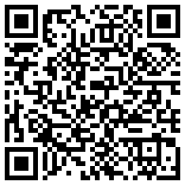

<article style="display:flex">
 

  <header>
	  <h1 class="title">About Me</h1>
  </header>
  
Security Engineer and Researcher, focused on encryption, TLS, and PKI

 

 

  <header>
    <h1 class="title">Email</h1>
    
First letter and at, followed by my domain
  </header>
  <header>
    <h1 class="title">ZCash - Shielded Address</h1>
    
z-addr: zs1lmyjscpj7dfjz26ld7h092p05efu85awdf0syup7fk5tdlkt2fd395a3u3m3emd3w3pdk08se0e

      
  </header>
  <header>
    <h1 class="title">ZCash - Transparent Address</h1>
    
t-addr:t1P82E8zApUys2e7KCpyqq3r981TNmQY5e5

    
  </header>

  <header>
    <h1 class="title"><a href="bitcoin:1K17AVYZMwV6V3Eka5PQdJfUmeTM2XKEQ5">Bitcoin</a></h1>
    
bitcoin:1K17AVYZMwV6V3Eka5PQdJfUmeTM2XKEQ5

    
  </header>
 

</article>
